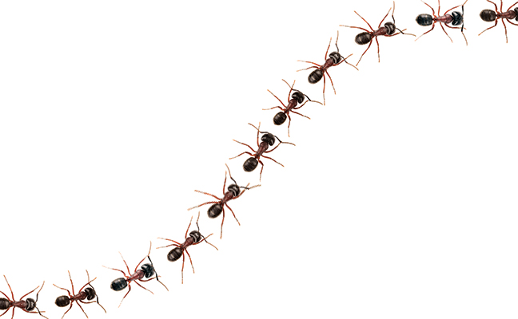
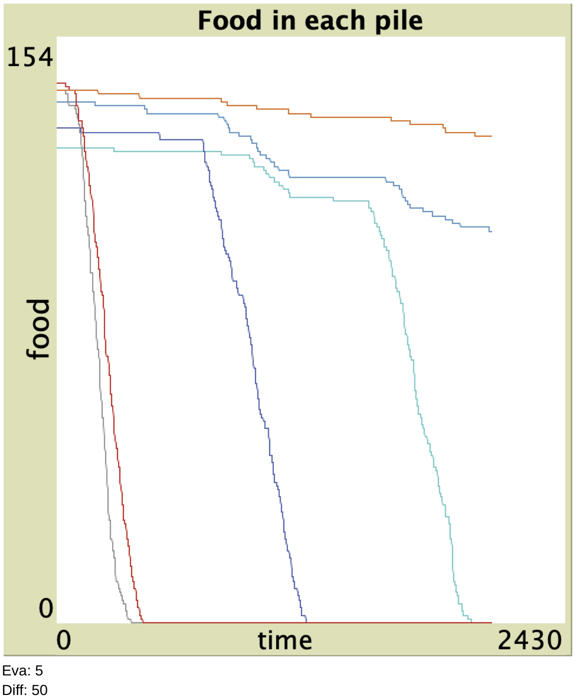
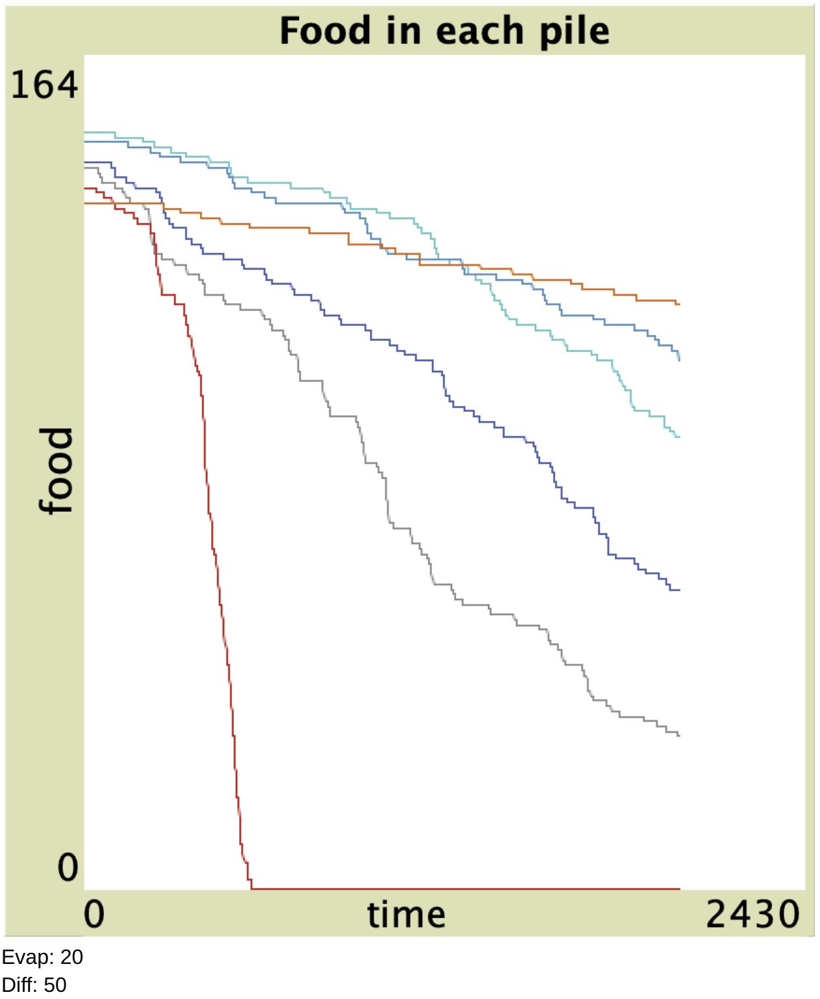
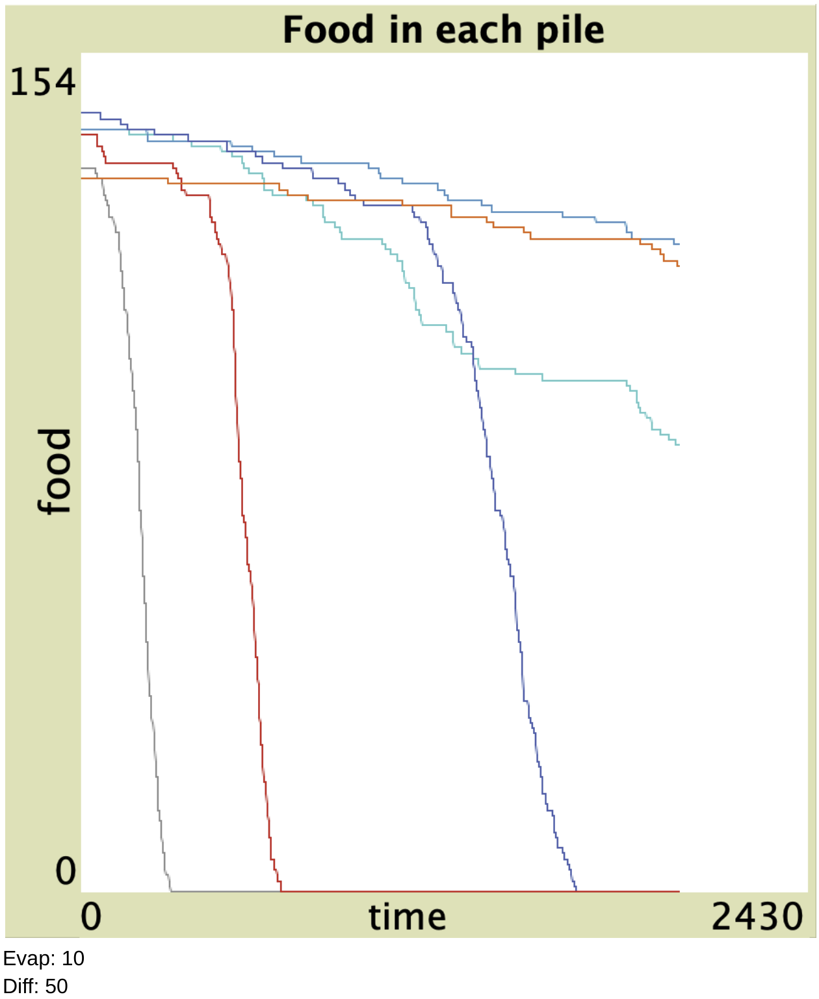
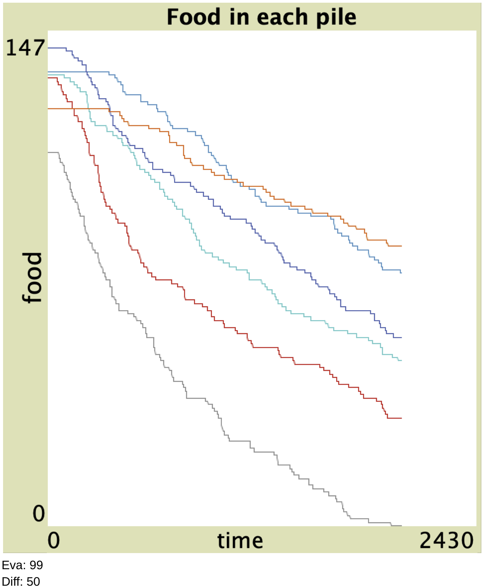

# Ant Trails
### Authors: Timothy Beal and Justin Riccardelli

## Introduction

Our project is using Agent-Based Modeling to model the movement of ants. When ants find food, it is common to see them form these trails from the food back to the nest. 

How do they do this? There are 2 main hypotheses that were considered. The first is that the ants would go back to the main ant in the nest and communicate where the food was which then gets communicated back to the other ants. Research found that there is not a noticeable difference when an ant comes back to their nest with or without food. This makes this hypothesis invalid. The way that ants can make these trails is using pheromones. When an ant finds food, on their way back to the nest they drop pheromones as they go which leaves a trail. When other ants come in range that they can smell it it leads them to the food. The ants finding the food will then do the same thing establishing a consistent and constant trail of pheromones. We can use Agent-Based Modeling to help us to model and understand this phenomona.

## Agent-based Modeling
In Agent-based modeling, “a system is modeled as a collection of autonomous decision-making entities called agents.” Each ant is essentially its own agent and makes autonomous decisions based on a predefined set of rules. 

Each ant has a set of properties, such as its rate of movement and other characteristic behaviors that helps to define how it moves, locating food, picking up food, and leaving a chemical trail as it returns to the nest. The ant knows whether or not to leave a chemical trail based on a binary value, as it has food or it doesn’t. We use this to understand the behavior of ants of how certain environments interact with the behavior of ants.

## How ants act in the model

### Model Variables
 - Population: Determines the quantity of ants in the simulation
 - Diffusion Rate: How wide the chemical trails left by ants are, smaller values results in thinner trails
 - Evaporation Rate: The rate at which the chemicals dropped by ants evaporate

In our model, ants have a certain set of rules they must follow. 
  // If not carrying-food? [ look-for-food ] if carrying-food? [ move-towards-nest ] wander //  
Initially, ants search the area for food, once an ant finds a food source, they grab it and head back to the nest, leaving a chemical trail as they travel with the food. This attracts other ants to the trail. As more ants migrate to the area and find the food source, the chemical trail becomes more consistent and constant, making a trail until the food source is gone.

Since chemical trails dissipate over a period of time, food sources that are further away are less likely to result in a constant chemical trail, however closer food sources are easier for ants to create a constant chemical trail.

## Code 
Sadly, we did not write our own model from scratch as writing in Netlogo gets very complex and follows very different characteristics then regular programming so even with computer science backgrounds we thought it would be more helpful to elaborate on a pre-existing model to demonstrate how environmental variable can impact ants ability to create ant trails using pheromones. 

## Results

We saw in our modeling that depending on how long that the ant pheromones stick around determines how effecient the ants are at bringing food back to the nest. Without the use of pheromones, ants would have to wonder aimlessly around the world trying to find food. 

## Conclusion

This a smale scale model of a phenomona that happens. Agent-Based modeling can be used for many other areas of study. One big one is studying the spread of disease, and as we've all seen that is some research that we really wish we had. We wanted to demonstrate how we can use Agent-Based modeling to examine how a set of rules something follows helps us model and be able to predict outcomes of something.
